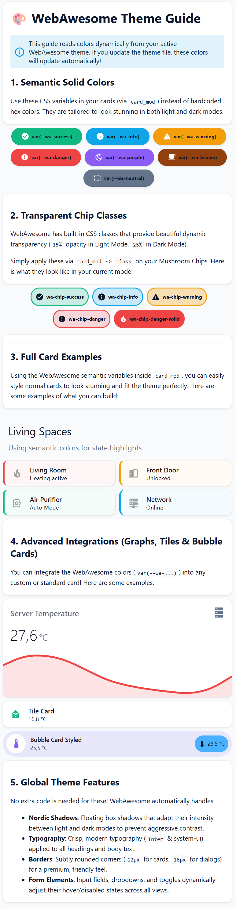
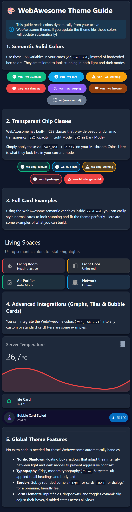

# WebAwesome Theme for Home Assistant 🎨

<div align="center">

[](https://github.com/hacs/integration) [](https://github.com/adnansarajlic/webawesome-ha-theme/commits/main) [](LICENSE)

</div>

<div align="center">
  <p align="center">
    A premium, modern theme for Home Assistant inspired by <a href="https://webawesome.com/">WebAwesome</a>.
    <br />
  </p>
</div>

<details>
  <summary>Table of Contents</summary>
  <ol>
    <li><a href="#screenshots">Screenshots</a></li>
    <li><a href="#home-assistant-setup">Home Assistant Setup</a></li>
    <li><a href="#hacs-installation">HACS installation</a></li>
    <li><a href="#enable-theme">Enable theme</a></li>
    <li><a href="#color-options">Color Options</a></li>
    <li><a href="#color-reference">Color Reference</a></li>
  </ol>
</details>

## Screenshots

<table>
  <tr>
    <td align="center" width="50%"><strong>Light Mode</strong><br /></td>
    <td align="center" width="50%"><strong>Dark Mode</strong><br /></td>
  </tr>
</table>

### Home Assistant Setup

Make sure that under the **configuration.yaml** file you have the following:

```yaml
frontend:
  themes: !include_dir_merge_named themes
```

### HACS installation

1. Go into the Community Store (HACS)
2. Search for WebAwesome theme
3. Open the theme
4. Press Install
5. (optional) Restart Home Assistant

### Enable theme

1. Open your Home Assistant **Profile**
2. Under **Themes**, select the new WebAwesome theme

### Color Options

Any of the colors can be used anywhere a color parameter is accepted in Home Assistant's configuration.

```yaml
## Example graph card using color from the theme variables.

type: custom:mini-graph-card
entities:
  - sensor.temperature
name: Weather
line_color: var(--wa-success)
line_width: 8
font_size: 100
hours_to_show: 168
points_per_hour: 0.25
```

### Color Reference

| Color Variable | Color Code | Color |
| :--- | :--- | :--- |
| `--wa-success` | `#10b981` |  |
| `--wa-info` | `#0ea5e9` |  |
| `--wa-warning` | `#f59e0b` |  |
| `--wa-danger` | `#ef4444` |  |
| `--wa-purple` | `#8b5cf6` |  |
| `--wa-brown` | `#92400e` |  |
| `--wa-neutral` | `#64748b` |  |

---
*Created by Adnan Sarajlic with inspiration from the WebAwesome team.*
